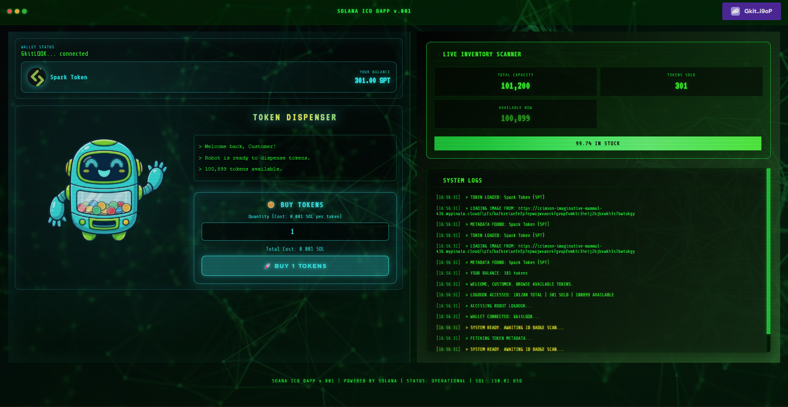
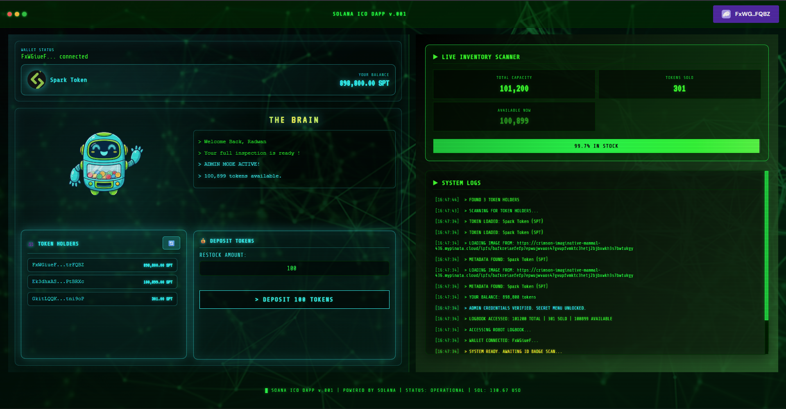
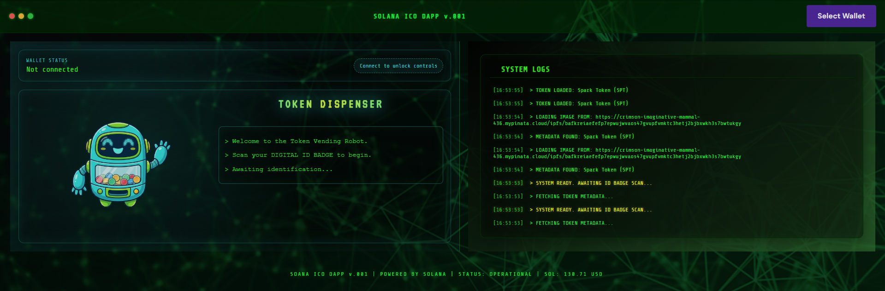

# 🚀 Solana ICO DApp - Token Vending Machine

A modern, feature-rich Initial Coin Offering (ICO) decentralized application built on the Solana blockchain using **Token-2022** (the latest Solana token standard). This DApp provides a sleek terminal-style interface for buying and managing custom SPL tokens with real-time updates and comprehensive admin controls.



---

## 🎯 Overview

This project is a fully functional ICO platform where users can purchase custom tokens using SOL, and administrators can manage the token supply, monitor token holders, and control the entire ICO ecosystem. The application features a unique cyberpunk-themed terminal interface that provides an immersive user experience.

---

## 🔧 Token Program Used

### **Token-2022 (Token Extensions Program)**

This project utilizes **Token-2022** (`TokenzQdBNbLqP5VEhdkAS6EPFLC1PHnBqCXEpPxuEb`), which is Solana's next-generation token standard. Token-2022 offers several advantages over the legacy SPL Token program:

#### **Key Features of Token-2022:**
- ✅ **Enhanced Metadata Support** - On-chain metadata storage with URI support
- ✅ **Transfer Fees** - Built-in fee mechanisms for token transfers
- ✅ **Confidential Transfers** - Privacy-preserving transaction capabilities
- ✅ **Interest-Bearing Tokens** - Native support for yield-generating tokens
- ✅ **Transfer Hooks** - Custom logic execution on token transfers
- ✅ **Permanent Delegate** - Enhanced control mechanisms
- ✅ **Backwards Compatible** - Works seamlessly with existing Solana infrastructure

#### **Why Token-2022?**
Token-2022 provides a more robust and feature-rich foundation for modern token applications. It's designed to support advanced use cases while maintaining compatibility with existing Solana tools and wallets.

**Program ID:** `TokenzQdBNbLqP5VEhdkAS6EPFLC1PHnBqCXEpPxuEb`

---

## 📋 Smart Contract Features

The smart contract (`SolanaICO.rs`) is built using the **Anchor framework** and implements the following core functionalities:

### **Contract Capabilities:**

1. **ICO Initialization (`create_ico_ata`)**
   - Creates a Program Derived Address (PDA) to hold ICO tokens
   - Initializes the ICO data account with admin credentials
   - Transfers initial token supply from admin to the program vault
   - Sets up the token distribution infrastructure

2. **Token Deposits (`deposite_ico_in_ata`)**
   - Allows admin to restock the ICO with additional tokens
   - Validates admin authority before accepting deposits
   - Updates total token supply in the data account
   - Uses `TransferChecked` for secure token transfers

3. **Token Purchases (`buy_tokens`)**
   - Enables users to buy tokens at a fixed rate (0.001 SOL per token)
   - Automatically creates user's Associated Token Account (ATA) if needed
   - Transfers SOL from buyer to admin
   - Transfers tokens from program vault to buyer
   - Updates tokens sold counter in real-time

### **Security Features:**
- ✅ **PDA-based token custody** - No private keys, fully on-chain security
- ✅ **Admin verification** - Only authorized admin can deposit tokens
- ✅ **Overflow protection** - Safe arithmetic operations with checked math
- ✅ **Mint verification** - Prevents wrong token deposits/purchases
- ✅ **Bump validation** - Protects against PDA spoofing attacks

**Token Price:** 0.001 SOL per token (1,000,000 lamports)  
**Token Decimals:** 9 (standard Solana token precision)

---

## 👤 User Capabilities

### **Regular Users Can:**


1. **Connect Wallet**
   - Seamless integration with Phantom, Solflare, and other Solana wallets
   - Automatic wallet detection and connection

2. **View Token Balance**
   - Real-time display of owned tokens
   - Token metadata including name, symbol, and image
   - Balance updates automatically after purchases

3. **Purchase Tokens**
   - Simple quantity input with cost calculator
   - Instant purchase confirmation
   - Automatic ATA creation if needed
   - Transaction hash for verification

4. **Monitor ICO Status**
   - Live inventory scanner showing:
     - Total capacity
     - Tokens sold
     - Available tokens
   - Visual progress bar indicating stock levels

5. **View Transaction Logs**
   - Real-time terminal-style activity feed
   - Color-coded messages (success, error, info, warning)
   - Timestamped transaction history

### **User Experience Features:**
- 🎨 Cyberpunk terminal aesthetic
- 📱 Fully responsive design (mobile-friendly)
- ⚡ Real-time SOL price display (via CoinGecko API)
- 🔔 Instant feedback on all actions
- 🎯 Smart error handling with helpful messages

---

## 🔐 Admin Capabilities

### **Administrators Can:**



1. **Initialize ICO System**
   - One-time setup to create the token distribution infrastructure
   - Establishes admin authority and program vault

2. **Deposit Tokens**
   - Restock the ICO with additional tokens from admin wallet
   - Flexible deposit amounts
   - Balance verification before deposits
   - Real-time inventory updates

3. **Monitor Token Holders**
   - View complete list of all token holders
   - See individual wallet addresses and balances
   - Refresh button for latest blockchain data
   - Sorted by token holdings

4. **Access Admin Dashboard**
   - Exclusive "THE BRAIN" control panel
   - Enhanced UI with admin-specific features
   - Comprehensive system status overview
   - Special admin-only terminal messages

5. **View Detailed Analytics**
   - Total tokens in circulation
   - Tokens sold vs. available
   - Real-time inventory tracking
   - Token holder distribution

### **Admin Security:**
- 🔒 Wallet-based authentication (only admin wallet has access)
- 🛡️ Smart contract-level admin verification
- 🔑 PDA-based token custody (no private key exposure)

---

## ⚡ Real-Time Automatic Updates

The application features comprehensive real-time functionality:

### **Automatic Updates Include:**

1. **SOL Price Tracking**
   - Fetches live SOL/USD price from CoinGecko API
   - Updates every 60 seconds
   - Displayed in the header for reference

2. **Token Balance Refresh**
   - Automatically updates after every purchase
   - Automatically updates after admin deposits
   - Fetches directly from blockchain (no caching)

3. **ICO Data Synchronization**
   - Total tokens, sold tokens, and available tokens update in real-time
   - Progress bar reflects current inventory status
   - Triggered after every transaction

4. **Token Holder List (Admin)**
   - Manual refresh button to scan blockchain
   - Fetches all token accounts for the mint
   - Displays owner addresses and balances
   - Sorted by holdings

5. **Transaction Log Feed**
   - Live terminal-style activity log
   - Color-coded messages:
     - 🟢 **Green** - Success messages
     - 🔴 **Red** - Error messages
     - 🟡 **Yellow** - Warning messages
     - 🔵 **Blue** - Info messages
     - 🟣 **Purple** - Admin-specific messages
   - Timestamps on all entries
   - Scrollable history

6. **Wallet Connection Status**
   - Instant detection of wallet connect/disconnect
   - Automatic UI adaptation based on connection state
   - Admin role detection on connection

---

## 🎨 Frontend Design

The frontend is built with **Next.js** and **React**, featuring:

- **Terminal-Style UI** - Cyberpunk aesthetic with retro terminal vibes
- **Glassmorphism Effects** - Modern frosted glass design elements
- **Responsive Layout** - Optimized for desktop, tablet, and mobile
- **Smooth Animations** - Pulse effects, blink animations, and transitions
- **Color-Coded Feedback** - Visual indicators for different message types
- **Robot Mascot** - Friendly vending machine robot character

### **Design Credits:**
This project's frontend design was refined and polished with the help of:
- **Antigravity AI** - For advanced UI/UX improvements and design suggestions
- **Cursor AI** - For code assistance and design implementation

---

## 🛠️ Technology Stack

### **Smart Contract:**
- Rust
- Anchor Framework (v0.26.0)
- Token-2022 (Token Extensions Program)
- Solana Program Library (SPL)

### **Frontend:**
- Next.js 13.2.4
- React 18.2.0
- @solana/web3.js
- @solana/wallet-adapter-react
- @project-serum/anchor
- TailwindCSS

### **APIs & Services:**
- CoinGecko API (SOL price data)
- Solana RPC (blockchain interaction)

---

## 📸 Screenshots

### User View - Token Purchase Interface

*Regular users can connect their wallet, view their balance, and purchase tokens through an intuitive interface.*

---

### Admin View - Control Panel

*Administrators have access to "THE BRAIN" - a comprehensive control panel for managing deposits, viewing token holders, and monitoring the entire ICO system.*

---

### Unauthorized View - Connection Required

*Users must connect their Solana wallet to access the token vending machine. The interface guides users through the connection process.*

---

## 🚀 Getting Started

### **Prerequisites:**
- Node.js (v16 or higher)
- A Solana wallet (Phantom, Solflare, etc.)
- SOL for transactions (devnet or mainnet)

### **Installation:**

```bash
# Clone the repository
git clone <repository-url>

# Navigate to project directory
cd solana-ico-dapp

# Install dependencies
npm install

# Run development server
npm run dev
```

### **Configuration:**

Update the following in `pages/index.js`:
- `PROGRAM_ID` - Your deployed smart contract address
- `ICO_MINT` - Your token mint address

### **Smart Contract Deployment:**

```bash
# Build the contract
anchor build

# Deploy to Solana
anchor deploy

# Initialize the ICO (from admin wallet)
# Use the frontend "Initialize Robot System" button
```

---

## 📝 Contract Details

**Program ID:** `8N2Vo6dFDUTPFz5waGuQfYFPZeS31ZeXgRcv3WqKptta`  
**Token Mint:** `22idMWuXMNwqXZqv5oCjk52zSuqALyhxqQf7tgyzi2Hp`  
**Token Program:** `TokenzQdBNbLqP5VEhdkAS6EPFLC1PHnBqCXEpPxuEb` (Token-2022)

---

## 🔒 Security Considerations

- ✅ All token transfers use `TransferChecked` for enhanced security
- ✅ Admin verification on all privileged operations
- ✅ PDA-based custody eliminates private key risks
- ✅ Overflow protection on all arithmetic operations
- ✅ Mint address validation prevents wrong token deposits

---

## 📄 License

This project is open source and available for educational purposes.

---

## 🤝 Contributing

Contributions, issues, and feature requests are welcome!

---

## 👨‍💻 Developer

Built with ❤️ using Solana blockchain technology.

**Design Assistance:** Antigravity AI & Cursor AI

---

## 📞 Support

For questions or support, please open an issue in the repository.

---

**Happy Token Vending! 🎉**
